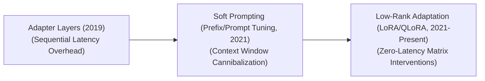

  

  
  
  

# 🚀 Awesome-Parameter-Efficient-Fine-Tuning
## 🧠 Parameter-Efficient Fine-Tuning (PEFT): Evolution, Variants, & Applications

Parameter-Efficient Fine-Tuning (PEFT) is a revolutionary model adaptation framework that enables the customization of massive foundation models without updating all of their base parameters. Traditional Full Fine-Tuning (FFT) requires adjusting every weight tensor in a network, which is computationally prohibitive and requires storing distinct, multi-gigabyte copies of the model for every downstream task. PEFT solves this by freezing the original model parameters and tuning only a tiny fraction (often $<1\%$) of auxiliary weights, drastically reducing computational overhead, storage footprints, and VRAM requirements while avoiding catastrophic forgetting. 🌟

---

## 🕰️ 1. The Chronological Evolution

The algorithmic progression of PEFT reflects a transition from sequential bottleneck architecture layers to dynamic soft-prompt injections, moving toward modern localized matrix decompositions.

| Methodology | Year | Paper Link | Concept | Limitation / Significance |
| :--- | :--- | :--- | :--- | :--- |
| [**The Bottleneck Adapter Era** (Houlsby et al., 2019)](pages/bottleneck_adapter_era.md) | 2019 | [1902.00751](https://arxiv.org/abs/1902.00751) | The foundation era. Injected small, feed-forward neural networks (adapters) sequentially between the self-attention and MLP layers of a Transformer. | *Limitation:* Introduced significant structural inference latency because data tokens had to traverse extra physical network layers sequentially. |
| [**The Soft Prompting Era** (Prefix-Tuning / Prompt Tuning, ~2021)](pages/soft_prompting_era.md) | 2021 | [2101.00190](https://arxiv.org/abs/2101.00190) / [2104.08691](https://arxiv.org/abs/2104.08691) | Prepended trainable, continuous virtual token embedding vectors directly to the keys/values of attention blocks or the initial input sequence. | *Limitation:* Cannibalized the model’s effective context window length by filling it up with static, non-text tuning tokens. |
| [**The Low-Rank Adaptation Era** (LoRA, ~2021–Present)](pages/low_rank_adaptation_era.md) | 2021 | [2106.09685](https://arxiv.org/abs/2106.09685) | Replaced layer additions with mathematical matrix decompositions ($W = W_0 + B \times A$). It tracks parameter delta changes inside two low-rank matrices without altering the base architecture weights. | *Significance:* Achieved **Zero Inference Latency** because the auxiliary matrix weights can be mathematically merged back into the base parameters permanently before deployment. |

---

## 🔬 2. Core Methodological Variants

PEFT techniques are structurally categorized based on how they alter or interact with the underlying neural network graph during backward passes.

| Category | Year | Paper Link | Mechanism | Examples |
| :--- | :--- | :--- | :--- | :--- |
| [**Additive Methods**](pages/additive_methods.md) | 2019 | [1902.00751](https://arxiv.org/abs/1902.00751) | Introduces brand-new parameters or token modules to the architecture that do not exist in the base configuration. | Standard Bottleneck Adapters, Prefix-Tuning, and Prompt Tuning. |
| [**Selective Methods**](pages/selective_methods.md) | 2021 | [2106.10199](https://arxiv.org/abs/2106.10199) | Identifies and isolates a highly specific subset of the model's existing base parameters to fine-tune, keeping the remaining majority completely frozen. | **BitFit** (which trains only the bias terms across the network) and Sparse Masking Selectors. |
| [**Reparameterization Methods**](pages/reparameterization_methods.md) | 2021 | [2106.09685](https://arxiv.org/abs/2106.09685) | Leverages low-rank intrinsic dimensions to parameterize structural weight updates mathematically, bypassing the need to instantiate full-size gradient update tensors. | LoRA, AdaLoRA, and DoRA. |

---

## ⚡ 3. Advanced LoRA Family Implementations

Because low-rank adaptation became the dominant industry framework, multiple highly optimized mutations emerged to increase parameter stability, convergence speed, and precision.

| Implementation | Year | Paper Link | Type | Mechanism | Significance / Pros |
| :--- | :--- | :--- | :--- | :--- | :--- |
| [**QLoRA** (Quantized Low-Rank Adaptation)](pages/qlora.md) | 2023 | [2305.14314](https://arxiv.org/abs/2305.14314) | Memory-Optimized Quantization. | Bakes LoRA matrices directly on top of a base model compressed into a specialized 4-bit NormalFloat (NF4) data type. It introduces double-quantization steps and paged optimizers to manage memory spikes. | *Significance:* Unlocked the ability to fine-tune a 70B parameter model on a single, consumer-grade GPU. |
| [**DoRA** (Weight-Decomposed Low-Rank Adaptation)](pages/dora.md) | 2024 | [2402.09353](https://arxiv.org/abs/2402.09353) | Structural Geometric Correction. | Decomposes the model updates into two distinct properties: magnitude (length) and direction (angle), applying LoRA mapping strictly to the directional components. | *Pros:* Closely mirrors the mathematical learning behavior of Full Fine-Tuning, vastly outperforming standard LoRA on complex math and coding tasks. |
| [**AdaLoRA** (Adaptive Low-Rank Adaptation)](pages/adalora.md) | 2023 | [2303.10512](https://arxiv.org/abs/2303.10512) | Dynamic Rank Allocation. | Uses singular value decomposition (SVD) metrics to dynamically allocate higher rank budgets ($r=16$ or $r=32$) to critical attention layers, while stripping rank budgets away from less important layers. | N/A |

---

## 🌍 4. Production & Downstream Applications

| Application | Year | Paper Link | Description |
| :--- | :--- | :--- | :--- |
| [**Multi-Tenant Saas API Environments**](pages/multi_tenant_saas.md) | 2023 | [2310.18547](https://arxiv.org/abs/2310.18547) | Cloud platform providers serve thousands of distinct corporate users from a single base model instance running in VRAM. Each user's request dynamically swaps in a lightweight, custom 20MB LoRA file at runtime, eliminating the cost of hosting thousands of standalone base models. |
| [**Edge & TinyML Device Personalization**](pages/edge_tinyml.md) | 2020 | [2007.11622](https://arxiv.org/abs/2007.11622) | Smart wearable devices or local robotic units adapt their language models on-device using local sensor feeds via QLoRA. This preserves user data privacy and handles training under tight hardware power caps. |
| [**Cross-Domain Modality Expansion**](pages/cross_domain_modality.md) | 2023 | [2304.08485](https://arxiv.org/abs/2304.08485) | Turning standard text-only Large Language Models into multi-modal Vision-Language Models. PEFT layers are trained exclusively over cross-attention visual projection adapters, mapping new image tokens to the frozen text engine. |

---

## 📈 Star History

<a href="https://www.star-history.com/?repos=ishandutta2007%2FAwesome-Parameter-Efficient-Fine-Tuning&type=date&legend=bottom-right">
<picture>
<source media="(prefers-color-scheme: dark)" srcset="https://api.star-history.com/chart?repos=ishandutta2007/Awesome-Parameter-Efficient-Fine-Tuning&type=date&theme=dark&legend=bottom-right" />
<source media="(prefers-color-scheme: light)" srcset="https://api.star-history.com/chart?repos=ishandutta2007/Awesome-Parameter-Efficient-Fine-Tuning&type=date&legend=bottom-right" />

</picture>
</a>

 
