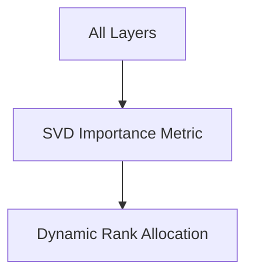

# AdaLoRA (Adaptive Low-Rank Adaptation)

Detailed information about AdaLoRA.

```mermaid
graph TD;
    A[All Layers] --> B[SVD Importance Metric];
    B --> C[Dynamic Rank Allocation];
```

[Back to README](../README.md)