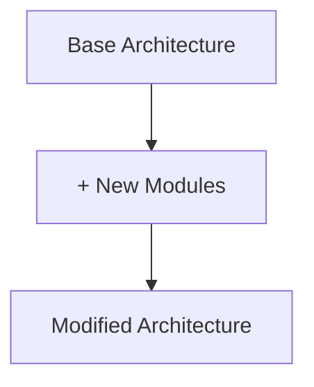

# Additive Methods

Detailed information about Additive Methods.

```mermaid
graph TD;
    A[Base Architecture] --> B[+ New Modules];
    B --> C[Modified Architecture];
```

[Back to README](../README.md)