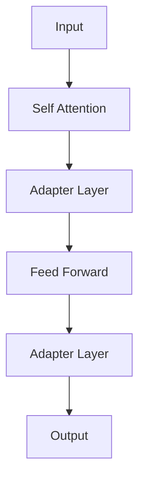

# The Bottleneck Adapter Era

Detailed information about Bottleneck Adapters.

```mermaid
graph TD;
    A[Input] --> B[Self Attention];
    B --> C[Adapter Layer];
    C --> D[Feed Forward];
    D --> E[Adapter Layer];
    E --> F[Output];
```

[Back to README](../README.md)