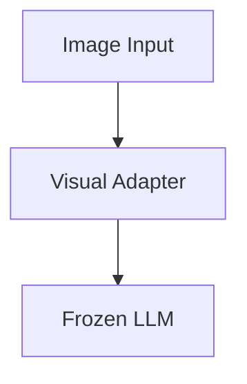

# Cross-Domain Modality Expansion

Detailed information about Cross-Domain Modality Expansion.

```mermaid
graph TD;
    A[Image Input] --> B[Visual Adapter];
    B --> C[Frozen LLM];
```

[Back to README](../README.md)