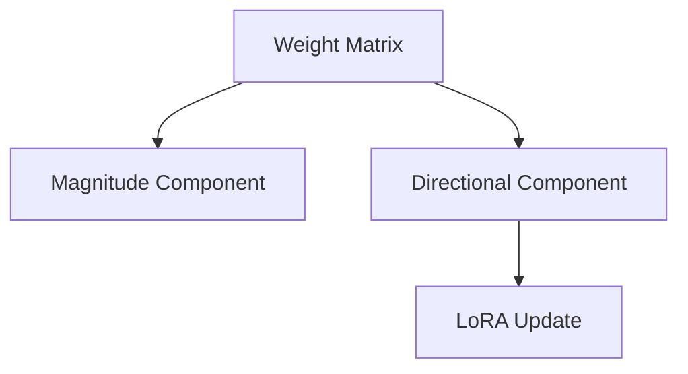

# DoRA (Weight-Decomposed Low-Rank Adaptation)

Detailed information about DoRA.

```mermaid
graph TD;
    A[Weight Matrix] --> B[Magnitude Component];
    A --> C[Directional Component];
    C --> D[LoRA Update];
```

[Back to README](../README.md)