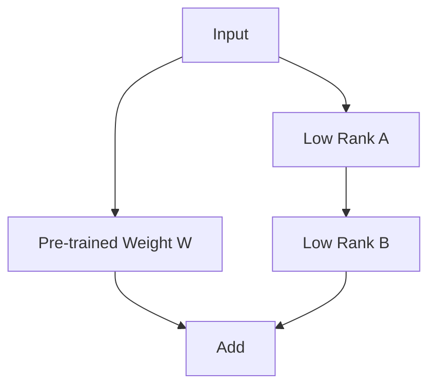

# The Low-Rank Adaptation Era (LoRA)

Detailed information about LoRA.

```mermaid
graph TD;
    A[Input] --> B[Pre-trained Weight W];
    A --> C[Low Rank A];
    C --> D[Low Rank B];
    B --> E[Add];
    D --> E;
```

[Back to README](../README.md)