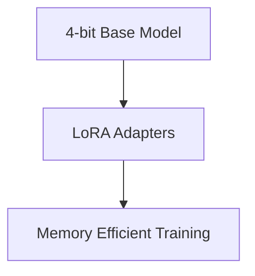

# QLoRA (Quantized Low-Rank Adaptation)

Detailed information about QLoRA.

```mermaid
graph TD;
    A[4-bit Base Model] --> B[LoRA Adapters];
    B --> C[Memory Efficient Training];
```

[Back to README](../README.md)