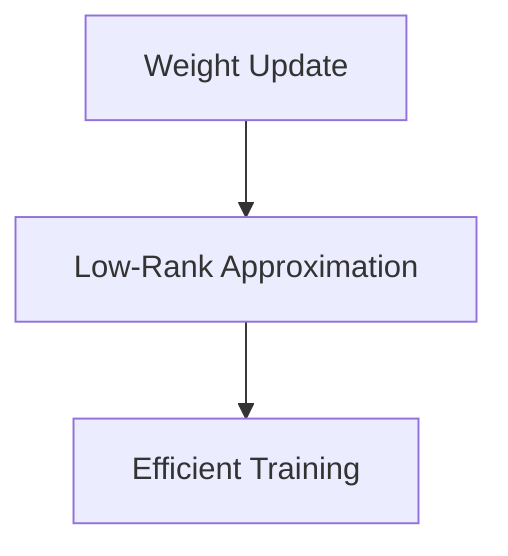

# Reparameterization Methods

Detailed information about Reparameterization Methods.

```mermaid
graph TD;
    A[Weight Update] --> B[Low-Rank Approximation];
    B --> C[Efficient Training];
```

[Back to README](../README.md)