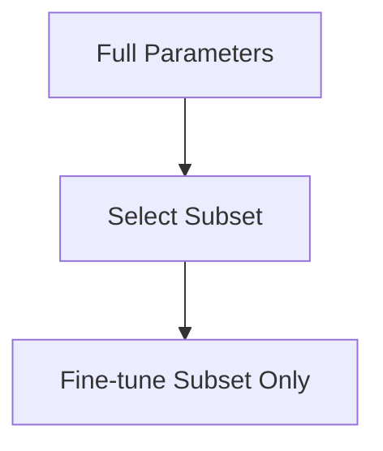

# Selective Methods

Detailed information about Selective Methods like BitFit.

```mermaid
graph TD;
    A[Full Parameters] --> B[Select Subset];
    B --> C[Fine-tune Subset Only];
```

[Back to README](../README.md)